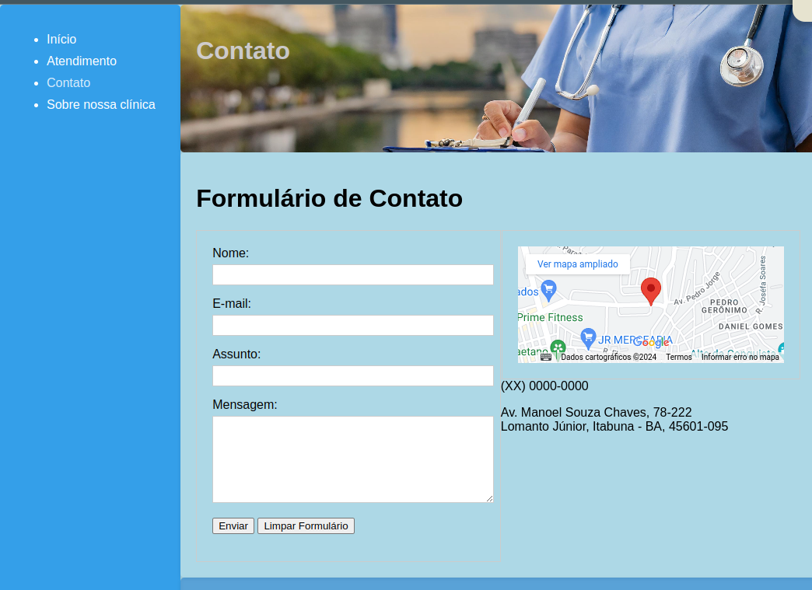

<h1>
    
    Formação HTML Web Developer
</h1>

# :computer: Criando seu Primeiro Site Completo com HTML
Este desafio tem como objetivo, criar um site "quase" completo, com tudo o que vimos neste módulo. Os temas que deverão ser abordados são:
Formulários
Estruturação e formatação de texto
Mídias
Tabelas
Além de outros recursos falados nas aulas!

O código-fonte base preparado para este Desafio de Projeto está versionado no GitHub, no seguinte endereço:

https://github.com/digitalinnovationone/trilha-html-modulo-2

# :bulb: Solução do desafio

Desenvolvimento de um site html5 com 4 páginas.

As imagens foram  geradas com o Adobe Firefly. O conteúdo e parte do estilo CSS com o google Gemini.

* Index:

* Atendimento:

* Contato:

* Sobre:
